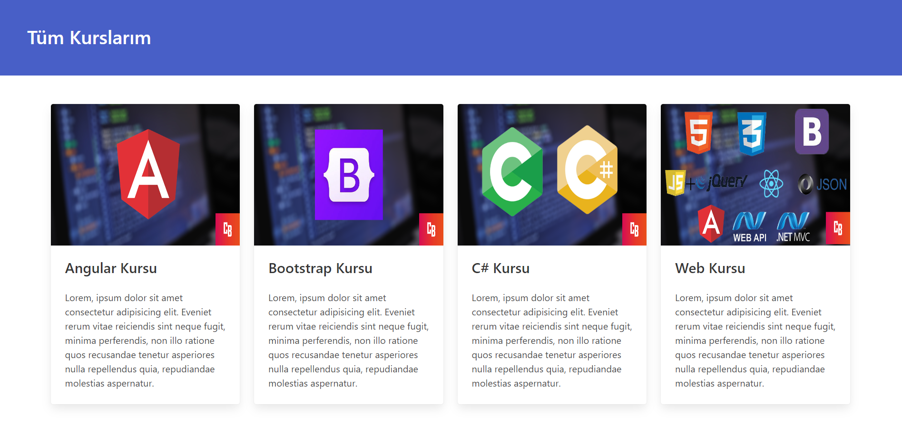

# Card App

A simple card application was developed to understand how the React framework works, learn the concept of components, and grasp props. React and the Bulma CSS library were used for this project.(EN)

React framework'un nasıl çalıştığını anlamak, component kavramını öğrenmek ve propsları kavramak için basit bir kart uygulaması geliştirildi. Bu proje için React ve Bulma CSS kütüphanesi kullanıldı.

## Ekran Görüntüleri (Screenshots)

  
